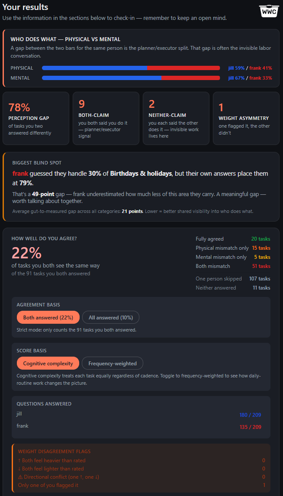

<h1 align="center">
  <picture>
    <source media="(prefers-color-scheme: dark)" srcset="wwc-icon-fill-square-white.png">
    
  </picture>
   
  What We Carry
</h1>

<em>A quiet check-in for couples about the work of running a life — not just who does it physically, but who holds it mentally.</em>

<a href="https://what-we-carry.pages.dev/"><strong>→ Try it: what-we-carry.pages.dev</strong></a>

  

## What it is

- A single HTML page. Open it, answer questions about everyday household work
  (about 200 tasks across 15 life areas, depending on your situation — a setup
  step hides categories that don't apply to you), and see a shared picture of
  what each of you carries.
- Each task is measured on two dimensions: the **physical doing** and the
  **mental holding** — the remembering, planning, tracking, and worrying.
  The mental dimension is the part most tools don't try to quantify.
- Designed around the physical-vs-mental distinction popularized by Eve Rodsky's
  *Fair Play* — but this is an independent tool, not affiliated with or endorsed
  by her or the *Fair Play* brand.

## What it isn't

- Not a score, grade, or verdict on your relationship.
- Not therapy, and not a replacement for talking to each other — it's a conversation starter.
- Not a product. No paywall, no upsell, no newsletter.

## Privacy

- Everything stays in your browser. No account, no sign-up, no server, no analytics.
- The site is a single static HTML page. You can read the source, unplug your
  internet, and it still works.
- The only way your answers leave is if you export them yourself.

## Use it

- **Hosted:** https://what-we-carry.pages.dev/ — the easiest path. Just open the link.
- **Self-host / offline:** grab `index.html` plus the two icon PNGs
  (`wwc-icon-fill-square-white.png` and `wwc-icon-fill-square-black.png`) from
  this repo (or download the ZIP under
  [Releases](https://github.com/PButters/what-we-carry/releases)), keep them in
  the same folder, and open `index.html` in any browser. The page works without
  the icons — but the tab favicon and header mark will be broken if you only
  grab the HTML. Both PNGs are used so the header and favicon look right in
  either light or dark mode.

## License

MIT. Use it, fork it, adapt it for your household, your practice, your community.
If you're thinking about wrapping it in a paywall and selling it — please don't.
Not what this is for.

## Feedback

Found a bug, odd result, or accessibility issue? Open an issue on this repo.
